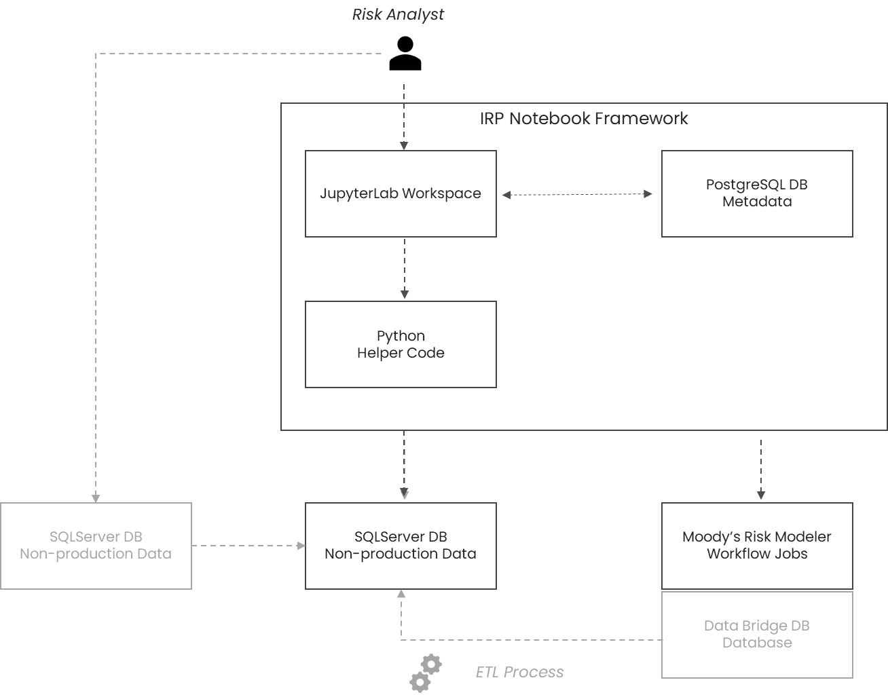
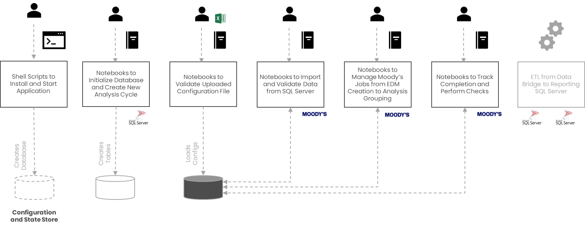
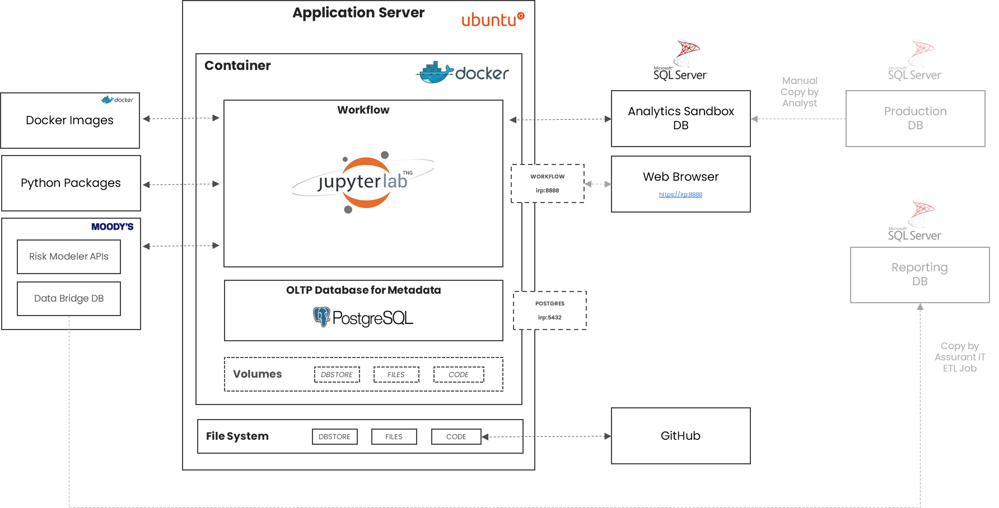
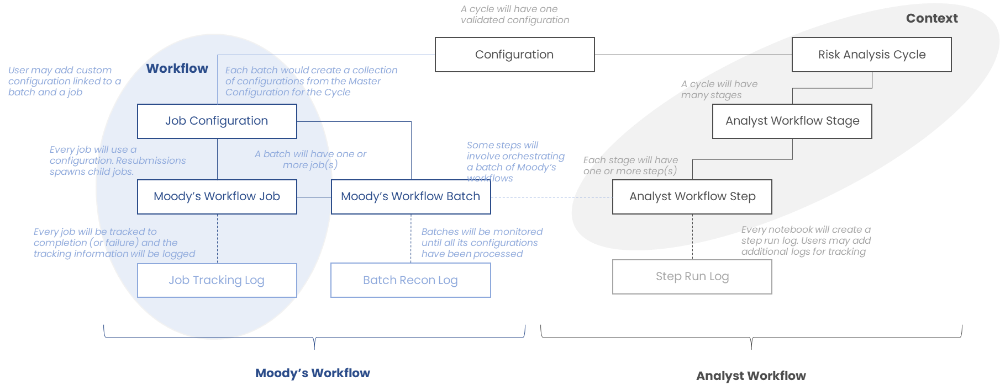
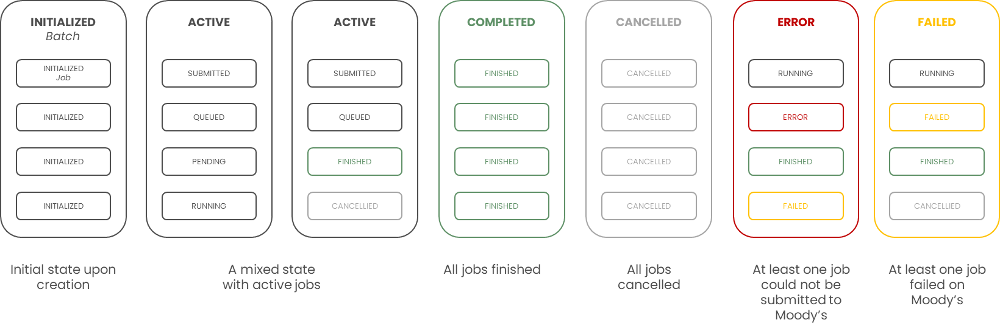
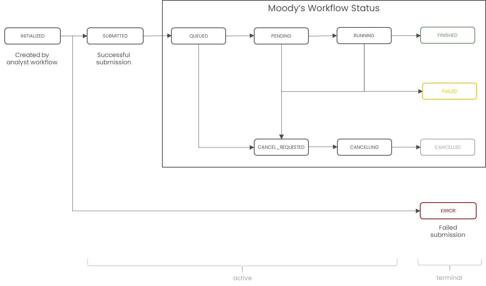

# IRP Notebook Framework - Design Document

**Version:** 1.0  
**Date:** October 2025  
**Status:** Active Development

---

## Table of Contents

1. [Executive Summary](#1-executive-summary)
2. [System Overview](#2-system-overview)
3. [Architecture](#3-architecture)
4. [Workflow Model](#4-workflow-model)
5. [Database Schema](#5-database-schema)
6. [Job and Batch Management](#6-job-and-batch-management)
7. [Configuration Management](#7-configuration-management)
8. [Controls and Logging](#8-controls-and-logging)
9. [External Integrations](#9-external-integrations)
10. [Known Issues and TODOs](#10-known-issues-and-todos)

---

## 1. Executive Summary

The **IRP (Insurance Risk Platform) Notebook Framework** is a Jupyter-based workflow management system designed to provide simple, user-friendly notebooks for risk analysts.

### Key Features

- **Visual Workflow Management**: Execute workflows through Jupyter notebooks
- **Robust State Management**: Tracking of cycles, stages, steps, batches, and jobs, giving visibility and alerts to user, while also giving control to the user to update and override.
- **Configuration-Driven**: Excel-based master configurations drive job generation
- **Moody's Integration**: Automated job submission and status tracking
- **Logging**: Automatic logging from notebooks with step detection
- **Disaster Recovery**: Rebuild capability from GitHub repository
- **Controlled Execution**: Guardrails to prevent duplicate step execution by checking for step run logs and alerting the user.
---

## 2. System Overview

### 2.1 Conceptual Architecture

#### Overview



#### High Level Stages




### 2.2 Technical Architecture

#### Overall Architecture



#### Tech Stack OVerview

- **Application Runtime**: Docker containers (Ubuntu)
- **Notebook Interface**: JupyterLab
- **Programming**: Python 3.11+
- **Metadata Database**: PostgreSQL
- **Source Database (Non-production)**: Microsoft SQL Server
- **Analytics Service**: Moody's Risk Modeler API
- **Configuration**: Excel files
- **Version Control**: Git/GitHub

### 2.3 Application Structure

```
workspace/
├── helpers/                       # Python Helper Modules
│
└── workflows/                     # Notebook Workflows
    ├── _Template/                 # Master template
    │   ├── notebooks/
    │   ├── files/
    │   │   ├── excel_configuration/
    │   │   └── data/
    │   └── logs/
    │
    ├── _Tools/                    # Management tools
    │
    ├── _Archive/                  # Completed cycles
    └── Active_Analysis-YYYY-QN/   # !! The Active Cycle !!
```

---

## 3. Overall Workflow Model

### 3.1 Conceptual Model



### 3.2 Entity Relationships

**Cycle**: A complete risk analysis (e.g., "Analysis-2025-Q4")
- Has ONE validated Configuration per cycle
- Contains multiple Stages

**Stage**: Major phase (Setup, Extract, Process, Submit, Monitor)
- Contains multiple Steps executed sequentially

**Step**: Unit of work (Jupyter notebook) for analyst
- May initiate a Batch for Moody's integration
- May perform data import operations

**Batch**: Collection of jobs from master configuration
- Created for specific batch type (e.g., EDM Creation)
- Statuses : INITIATED, ACTIV, COMPLETED, FAILED, CANCELLED, ERROR
- Contains one or mode Job(s)
- Tracked via Batch Recon process

**Job Configuration**: Individual job parameters
- Generated from the Excel Configuration based on batch type
- Can be reused across resubmissions
- May be overridden during resubmission (one-off correction for a job)

**Job**: Individual unit of work submitted to Moody's
- Statuses: INITIATED, SUBMITTED, ERROR + Moody's Statuses
- Can be skipped to tell Recon its status can be ignored

### 4.3 Workflow Execution Flow

```
Create CYCLE

Upload and validate CONFIGURATION (Excel)
Execute STEPS in sequential STAGES
If step needs Moody's: create_batch()
├── Generate job configuration(s)
├── Create BATCH record (in INITIATED status)
├── For each config: Create JOB_CONFIGURATION and JOB (in INITIATED status)
└── Submit Batch
    ├── Check for VALID configuration
    ├── Check for ACTIVE cycle linked to the configuration 
    ├── Submit Job - for each job in INITIATED status
    └── Update batch (ACTIVE status)
Track Job Status
Reconcile Batch by checking all non-skipped Jobs
Optionally, resubmit Job(s)
Archive CYCLE when complete
```

---

## 5. Database Schema

### 5.1 Core Tables

#### irp_cycle
Represents a complete analysis cycle.

| Column | Type | Description |
|--------|------|-------------|
| id | SERIAL | Primary key |
| cycle_name | VARCHAR(255) | Unique (e.g., "Analysis-2025-Q4") |
| status | cycle_status_enum | ACTIVE or ARCHIVED |
| created_ts | TIMESTAMPTZ | Creation timestamp |
| archived_ts | TIMESTAMPTZ | Archive timestamp (nullable) |

**Business Rules**:
- Only one ACTIVE cycle at a time
- Pattern: `Analysis-YYYY-QN` or `Analysis-YYYY-QN-v#`

#### irp_configuration
Validated Excel configuration files.

| Column | Type | Description |
|--------|------|-------------|
| id | SERIAL | Primary key |
| cycle_id | INTEGER | FK to irp_cycle |
| configuration_file_name | VARCHAR(2000) | Original filename |
| configuration_data | JSONB | Parsed configuration |
| status | configuration_status_enum | NEW, VALID, ACTIVE, ERROR |
| file_last_updated_ts | TIMESTAMPTZ | File modification time |

**Business Rules**:
- One configuration per cycle
- Must be VALID or ACTIVE to create batches

#### irp_batch
Batch of Moody's jobs.

| Column | Type | Description |
|--------|------|-------------|
| id | SERIAL | Primary key |
| step_id | INTEGER | FK to irp_step |
| configuration_id | INTEGER | FK to irp_configuration |
| batch_type | VARCHAR(255) | Type of batch processing |
| status | batch_status_enum | See status flow below |
| submitted_ts | TIMESTAMPTZ | Submission time |
| completed_ts | TIMESTAMPTZ | Completion time |

**Batch Status Flow**:



#### irp_job_configuration
Individual job configurations.

| Column | Type | Description |
|--------|------|-------------|
| id | SERIAL | Primary key |
| batch_id | INTEGER | FK to irp_batch |
| configuration_id | INTEGER | FK to irp_configuration |
| job_configuration_data | JSONB | Specific job config |
| skipped | BOOLEAN | Is configuration skipped? |
| overridden | BOOLEAN | Is this an override? |
| override_reason_txt | VARCHAR(1000) | Reason for override |

#### irp_job
Individual Moody's workflow jobs.

| Column | Type | Description |
|--------|------|-------------|
| id | SERIAL | Primary key |
| batch_id | INTEGER | FK to irp_batch |
| job_configuration_id | INTEGER | FK to irp_job_configuration |
| moodys_workflow_id | VARCHAR(50) | Moody's identifier |
| status | job_status_enum | Job status |
| skipped | BOOLEAN | Is job skipped? |
| last_error | TEXT | Last error message |
| parent_job_id | INTEGER | Parent job (resubmissions) |
| submitted_ts | TIMESTAMPTZ | Submission time |
| completed_ts | TIMESTAMPTZ | Completion time |
| submission_request | JSONB | Request payload |
| submission_response | JSONB | Response payload |

**Job Status Flow**:



**Note**: Jobs can be marked as `skipped=TRUE` so the recon can discount them.

### 5.2 Status Values

**Batch Status**:
- INITIATED, ACTIVE, COMPLETED, FAILED, CANCELLED, ERROR

**Job Status**:
- INITIATED, SUBMITTED, QUEUED, PENDING, RUNNING
- FINISHED, FAILED, ERROR
- CANCEL_REQUESTED, CANCELLING, CANCELLED

**Configuration Status**:
- NEW, VALID, ERROR

**Cycle Status**:
- ACTIVE, ARCHIVED

**Step Run Status**:
- ACTIVE, COMPLETED, FAILED, SKIPPED

---

## 6. Job and Batch Management

### 6.1 Batch Creation

**Function**: `create_batch(batch_type, configuration_id, step_id)`

**Process**:
1. Validate inputs (config VALID, batch_type registered)
2. Apply ConfigurationTransformer to generate job configs
3. Create batch record (INITIATED)
4. For each job config: create job_configuration and job
5. Return batch_id

### 6.2 Batch Submission

**Function**: `submit_batch(batch_id)`

**Process**:
1. Validate prerequisites (config VALID/ACTIVE, cycle ACTIVE)
2. For each INITIATED, non-skipped job: call submit_job()
3. Update batch (ACTIVE, submitted_ts)
4. Update configuration (ACTIVE)
5. Return submission summary

### 6.3 Job Submission

**Function**: `submit_job(job_id, force=False, track_immediately=False)`

**Process**:
1. Read job details
2. Check if already submitted (unless force=True)
3. Call _submit_job() (currently stubbed)
4. Register submission (update with workflow_id, SUBMITTED status)
5. Optionally track immediately

**Current Stub**: Generates random workflow_id: `MW-XXXXXX`

### 6.4 Job Tracking

**Function**: `track_job_status(job_id)`

**Process**:
1. Read job (get current status and workflow_id)
2. Poll Moody's API (currently stubbed with realistic transitions)
3. Insert tracking log entry
4. Update job status if changed
5. Return current status

**Stub Transitions**:
- SUBMITTED → [QUEUED, PENDING]
- QUEUED → [PENDING, RUNNING]
- PENDING → [RUNNING]
- RUNNING → [RUNNING, FINISHED, FAILED]

### 6.5 Batch Reconciliation

**Function**: `recon_batch(batch_id)`

**Purpose**: Determine batch status based on job statuses

**Logic** (priority order):
1. **CANCELLED**: All non-skipped jobs are CANCELLED
2. **ERROR**: ≥1 non-skipped job is ERROR
3. **FAILED**: ≥1 non-skipped job is FAILED
4. **COMPLETED**: All non-skipped configs have ≥1 FINISHED job
5. **ACTIVE**: Otherwise

**Returns**: Recon summary with job counts, status breakdown, and new batch status

### 6.6 Job Resubmission

**Function**: `resubmit_job(job_id, job_configuration_data=None, override_reason=None)`

**Use Cases**:
1. **Retry with same config**: Transient failure
2. **Retry with override**: Bad configuration

**Process**:
1. Validate inputs (override requires reason)
2. Read original job
3. Create new job (with or without override config)
4. Submit new job
5. Skip original job (skipped=TRUE)
6. Return new job_id

**Audit Trail**: parent_job_id creates lineage

---

## 7. Configuration Management

### 7.1 Configuration Upload

**Function**: `upload_configuration(cycle_id, file_path)`

**Process**:
1. Validate cycle (exists, ACTIVE)
2. Check no existing config (one per cycle)
3. Read Excel file, parse sheets
4. Validate structure
5. Store as JSONB with status VALID or ERROR

**Validation Rules**:
- Required tabs: TAB-A, TAB-B
- Required columns per tab

### 7.2 Configuration Transformation

**Class**: `ConfigurationTransformer`

**Purpose**: Transform master config into job configs

```python
class ConfigurationTransformer:
    _transformers = {}

    @classmethod
    def register(cls, batch_type: str, transformer_func):
        cls._transformers[batch_type] = transformer_func

    @classmethod
    def get_job_configurations(cls, batch_type: str, master_config: Dict) -> List[Dict]:
        transformer = cls._transformers[batch_type]
        return transformer(master_config)
```

**Example**:
```python
def portfolio_transformer(master_config: Dict) -> List[Dict]:
    jobs = []
    for portfolio in master_config['portfolios']:
        jobs.append({
            'portfolio_id': portfolio['id'],
            'analysis_date': master_config['analysis_date'],
            'parameters': master_config['parameters']
        })
    return jobs

ConfigurationTransformer.register('portfolio_analysis', portfolio_transformer)
```

---

## 8. Controls and Logging

### 8.1 Workflow Controls

1. **Single Active Cycle**: Only one ACTIVE cycle allowed
2. **Configuration Uniqueness**: One config per cycle
3. **Step Execution Guards**: Warn if step run >1 time in cycle (user can override)
4. **Batch Validation**: Cannot submit unless config VALID/ACTIVE and cycle ACTIVE

### 8.2 Logging Architecture

**Automatic Step Logging**:
```python
# Top of notebook
step_run_id = start_step(__file__)

# Bottom of notebook
end_step(step_run_id, status='COMPLETED', output_data={...})
```

**Logging Tables**:
- `irp_step_run`: Step execution history
- `irp_job_tracking_log`: Job status polling
- `irp_batch_recon_log`: Batch reconciliation

### 8.3 Temporary/Stage Files

**Location**: `/home/jovyan/workspace/files/`
- `excel_configuration/`
- `data/` (staging CSVs)
- `temp/`
- `results/`

**Lifecycle**: Optional cleanup at end of cycle

### 8.4 Disaster Recovery

1. Clone repository
2. Run `./start.sh`
3. Initialize database
4. Restore archived cycles
5. Restore temp files from backup

---

## 9. External Integrations

### 9.1 Moody's Risk Modeler API

**Current Status**: STUBBED

**Expected Endpoints**:
- `POST /workflows/submit`: Submit job
- `GET /workflows/{id}/status`: Get status
- `GET /workflows/{id}/results`: Get results
- `POST /workflows/{id}/cancel`: Cancel job

**TODO**:
- Implement actual HTTP calls
- Handle authentication
- Implement retry logic
- Handle rate limiting
- Map statuses to JobStatus enum

### 9.2 SQL Server Integration

**Purpose**: Source data extraction

**Usage**:
```python
from helpers.database import execute_source_query

df = execute_source_query("SELECT * FROM Portfolios WHERE date = %s", (date,))
df.to_csv(f"{FILES_PATH}/portfolios.csv", index=False)
```

---

## 10. Known Issues and TODOs

### 10.1 Critical Issues (Must Fix Before Production)

#### Issue 1: No Error Handling in Job Submission
**Location**: workspace/helpers/job.py:569-577

**Problem**: Missing error handling for submission failures

**Impact**: Jobs can get stuck in SUBMITTED when API fails

**Fix**:
```python
def submit_job(job_id, force=False, schema='public'):
    try:
        workflow_id, request, response = _submit_job(job_id, job_config)
        _register_job_submission(...)
    except Exception as e:
        query = "UPDATE irp_job SET status = %s, last_error = %s WHERE id = %s"
        execute_command(query, (JobStatus.ERROR, str(e), job_id), schema)
        raise JobError(f"Job submission failed: {e}")
```

#### Issue 2: Resubmit Job Missing Error Handling
**Location**: workspace/helpers/job.py:777-778, 792-793

**Problem**: If resubmitted job fails, original is already skipped

**Fix**: Catch submission errors, consider un-skip option

#### Issue 3: Batch Recon cancelled_job_ids Bug
**Location**: workspace/helpers/batch.py:678

**Problem**:
```python
# Current (gets ALL jobs)
cancelled_job_ids = [j['id'] for j in non_skipped_jobs]

# Should be (only CANCELLED jobs)
cancelled_job_ids = [j['id'] for j in non_skipped_jobs 
                     if j['status'] == JobStatus.CANCELLED]
```

### 10.2 Medium Priority Enhancements

1. **Configuration Validation**: Implement validation against batch type schema (job.py:480-484)
2. **Step Lookup**: Implement `_lookup_step_id()` or keep explicit requirement (batch.py:110-129)
3. **Moody's API Integration**: Replace stubs with actual implementation

### 10.3 Documentation TODOs

1. **Configuration Status ACTIVE**: Document usage or remove (constants.py:97)
2. **Batch Recon TODO**: Remove stale TODO comment (job.py:575-576) - already implemented

---

## Appendices

### Appendix A: Job Status Flow Diagram

```
┌─────────────┐
│  INITIATED  │
└──────┬──────┘
       │ submit_job()
       ▼
┌─────────────┐
│  SUBMITTED  │
└──────┬──────┘
       │ track_job_status()
       ▼
┌─────────────┐
│   QUEUED    │
└──────┬──────┘
       │
       ▼
┌─────────────┐
│   PENDING   │
└──────┬──────┘
       │
       ▼
┌─────────────┐
│   RUNNING   │
└──────┬──────┘
       │
       ├─────────────┐
       ▼             ▼
┌─────────────┐  ┌─────────────┐
│   FINISHED  │  │   FAILED    │
└─────────────┘  └──────┬──────┘
                        │ resubmit_job()
                        ▼
                 ┌─────────────┐
                 │  INITIATED  │ (new job, parent_job_id set)
                 └─────────────┘

Alternative: INITIATED → ERROR (submission failure)
Alternative: QUEUED/ PENDING / RUNNING → CANCEL_REQUESTED → CANCELLING → CANCELLED
Alternative: Any job → skipped=TRUE (manual skip or resubmission)
```

### Appendix B: Batch Status Flow Diagram

```
┌─────────────┐
│  INITIATED  │
└──────┬──────┘
       │ submit_batch()
       ▼
┌─────────────┐
│   ACTIVE    │
└──────┬──────┘
       │ recon_batch()
       ├─────────────────┬─────────────┬───────────┐
       ▼                 ▼             ▼           ▼
┌─────────────┐   ┌──────────┐   ┌────────┐  ┌───────────┐
│  COMPLETED  │   │  ERROR   │   │ FAILED │  │ CANCELLED │
└─────────────┘   └──────────┘   └────────┘  └───────────┘
```

---

## References

- Database Schema: workspace/helpers/db/init_database.sql
- Job Management: workspace/helpers/job.py
- Batch Management: workspace/helpers/batch.py
- Configuration: workspace/helpers/configuration.py
- Constants: workspace/helpers/constants.py
